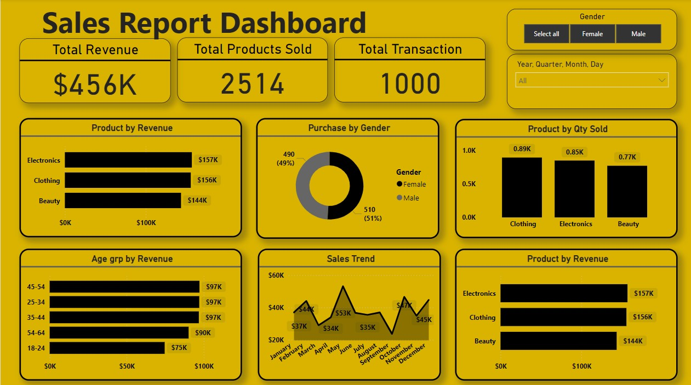
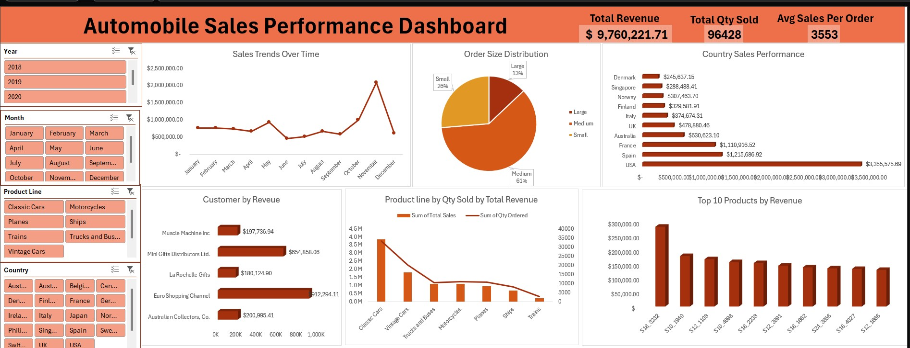

# Power BI Project 

**Title:** End-to-End Sales Performance & Product Analytics Dashboard

**Tools Used:** 
* Power BI Desktop – Interactive dashboards, KPI cards, slicers, drill-downs, tooltips, and report navigation.
* DAX – Advanced measures including YTD, LY, YoY comparisons, profitability classification, dynamic text summaries, and conditional indicators.
* Power Query (M) – Data cleaning, transformation, data type enforcement, and query optimisation.
* SQL (T-SQL) – Writing SQL scripts for data extraction, joins, filtering, and aggregation
* Preparing analysis-ready datasets prior to loading into Power BI
* SQL Server / Relational Databases – Primary structured data source for fact and dimension tables.
* Data Modelling – Star schema design with fact tables and multiple dimensions (Date, Product, Store, Sales Team).
* Time Intelligence – Calendar table creation, fiscal logic, YTD and LY calculations.
* Conditional Formatting & SVG Icons – Dynamic visual indicators showing performance versus prior periods.
* Report Design & UX – Dark-theme dashboard design, layout consistency, and executive-focused storytelling.
* Performance Optimisation – Measure reuse, efficient filter context handling, and reduced model complexity.

**Project Description:** This project involved building an end-to-end sales analytics solution that combines SQL-based data preparation with Power BI modelling and advanced DAX. Multiple data sources, including SQL databases, Excel files, and CSV files, were integrated into a single analytical model.

The dashboard was designed to support both high-level performance monitoring and detailed product-level analysis. Interactive filters allow users to explore trends by time period, product, store, and sales team, while dynamic KPIs and conditional indicators highlight areas of strong and weak performance.

**Key findings:**   

* Key Performance Indicators (KPIs):
* Total Sales: £73.14M
* Total Quantity Sold: 36,162 units
* Total Orders: 7,991
* Total COGs: £51.82M
* Total Profit: £21.33M
* Year-to-Date Sales: £8.52M

Analytical Insights:   

* Analytical Insights
* Sales performance remains strong, supported by consistent year-to-date growth.
* Profitability is healthy, reflecting effective cost control and stable margins.
* A small number of products and categories drive a large proportion of total sales and profit.
* Monthly trends show clear seasonality, with stronger performance mid-year and towards year-end.
* Product fulfilment analysis highlights areas where delivery performance could be improved to reduce outstanding quantities.

Dashboard Overview:

# Power BI Project

**Title:** Sales Insight Dashboard

**Tools Used:** Data Visualization: Designed and created interactive visualizations to represent sales performance metrics.
Data Filtering (Slicers): Incorporated slicers for filtering data by gender, year, quarter, month, and day.
Data Aggregation: Summarized data using measures such as total revenue, total products sold, and total transactions.
Dynamic Reporting: Enabled drill-down capabilities and dynamic updates to ensure flexibility in analysis.

**Project Description:** This project involved creating a sales report dashboard to provide a holistic overview of business performance metrics. The dashboard was designed using Power BI and incorporates dynamic filtering, visual elements, and KPIs to provide actionable insights for decision-making. The dashboard focuses on summarizing sales trends, customer demographics, and product performance.

**Key findings:**   

Key Performance Indicators (KPIs):

* Total revenue: $456K.
* Total products sold: 2,514 units.
* Total transactions: 1,000.

Revenue Insights:   

* Top-performing products by revenue: Electronics ($157K), Clothing ($156K), and Beauty ($144K).
* Revenue distribution by age group: Customers aged 25-54 contributed the most revenue ($97K each).

Gender-based Analysis:
* Purchase split: 51% male and 49% female.

Sales Trends:
* Monthly trends showed peaks in June, September, and November.

Product Trends:
* Quantity sold by product category: Clothing (0.89K), Electronics (0.85K), and Beauty (0.77

Dashboard Overview:

# SQL Project 1

**Title:** Hospital Emergency Department Dataset - SQL Data Manipulation & Interrogation

**SQL Code:** [Hospital Emergency Room SQL Code](https://github.com/Ezseun/Ezseun.github.io/blob/main/Hospital%20_Emergency_Room.sql)

**SQL Skills Used:** 
Data Retrieval (SELECT): Queried and extracted specific information about patient demographics, wait times, admissions, and satisfaction scores.
Data Aggregation (AVG, COUNT, SUM): Calculated averages (e.g., wait times), totals (e.g., patient counts), and percentages (e.g., admission rates) for comprehensive trend analysis.
Data Filtering (WHERE, BETWEEN, IN, AND): Applied filters to select relevant data, such as analyzing specific age groups, departments, and patient satisfaction levels.
Common Table Expressions (CTE): Used CTE to simplify complex queries and improve code readability for analyzing trends and relationships in the dataset.
Data Source Specification (FROM): Utilized the hospital emergency room dataset as the primary data source for analysis.

**Project Description:**
The primary objective of this project was extracting actionable insights and performing detailed trend analyses from a hospital emergency department dataset spanning two years and consisting of 9216 rows of data. Key analyses included:

Demographic Trends: Understanding patient age, gender, and racial distributions.
Performance Metrics: Evaluating department efficiency through average wait times and admission rates.
Correlation Studies: Identifying relationships between wait times and satisfaction scores.
Seasonal Trends: Analyzing monthly and yearly admission patterns.
Departmental Insights: Highlighting the most referred departments and their associated metrics.

**Technology used:** SQL server

# SQL Project 2

**Title:** Automobile Sales Data Analysis - SQL Data Manipulation & Interrogation

**SQL Code:** [Automobile Sales Data Analysis SQL Code](https://github.com/Ezseun/Ezseun.github.io/blob/main/Automobile_Sales_Analysis.sql)

**SQL Skills Used:**

**Data Retrieval (SELECT):** Queried and extracted specific information, such as sales trends, product performance, and customer contributions.
**Data Aggregation (SUM, COUNT, AVG):** Calculated totals (e.g., total revenue, quantity sold), averages (e.g., average order value), and record counts to analyze data trends.
**Data Filtering (WHERE, BETWEEN):** Applied filters to select relevant data, including filtering by time periods, countries, and deal sizes.
**Data Grouping (GROUP BY):** Grouped data by key fields like product lines, regions, and time periods to generate insightful summaries.
**Data Sorting (ORDER BY):** Ordered results by metrics like revenue and quantity sold to rank high-performing products and regions.
**Common Table Expressions (CTEs):** Used CTEs to simplify complex queries and improve readability.
**Window Functions (LAG, RANK):** Analyzed growth rates, ranked regions/products, and calculated rolling metrics.  
  
**Project Description:**

This project involved analyzing automobile sales data to generate actionable insights for improving business performance. Using SQL queries, the analysis uncovered trends in sales, regional performance, product line contributions, and customer behavior. Key findings included identifying top-performing regions, high-revenue products, and seasonal sales trends. This project demonstrates advanced SQL capabilities, including data aggregation, filtering, and dynamic analysis using CTEs and window functions.

**Technology Used:** SQL Server (SSMS)

# Excel Project 1

** Title:** [Heart Health Insight Dashboard](https://github.com/Ezseun/Ezseun.github.io/blob/main/heart_attack_youth_adult_france.xlsx)

**Tools Used:** Micosoft Excel (Excel formulas, Get Pivot Data, Pivot Table, Pivot Chat, Slicers, Timelines, and many more)

**Project Description:** 
This project explores key factors contributing to heart conditions using a dataset focused on demographic, lifestyle, and regional variables. The dashboard, built entirely in Excel, provides an interactive and visual analysis to help stakeholders identify trends and risk factors related to heart health.
Key features of the dashboard include:
1.	Patients by Age Group: A bar chart categorizing patients into different age groups to identify the most affected demographics.
2.	Patients by Sex Distribution: A pie chart showing the proportion of male, female, and other genders, aiding in demographic analysis.
3.	Heart Attack Rate by Region: A horizontal bar chart displaying the prevalence of heart attacks across regions.
4.	Heart Attack Rate by BMI Category: A column chart highlighting the relationship between BMI categories (Normal, Overweight, Obese) and heart attack occurrences.
5.	Smoking Status vs Heart Attack: A clustered bar chart visualizing the impact of smoking habits on heart attack rates.
6.	Key Metrics and Filters:
o	Total patients, total heart attack cases, and heart attack percentage are displayed as KPIs for a quick overview.
o	Interactive slicers allow users to filter data dynamically by Age Group, Sex, Region, and Smoking Status.

**Key findings:**
1. Demographic Trends
The 46–55 age group has the highest number of heart attack cases, closely followed by the 36–45 age group, highlighting that middle-aged adults are the most affected demographic.
The 56+ age group shows a significant drop in cases compared to the 46–55 group, possibly due to survival bias or better health management in older adults.
Males and females have nearly equal representation (48% each), with Other genders accounting for 4%.
2. Lifestyle Factors
Smoking: Smokers experience heart attacks slightly more frequently than non-smokers:

Smokers with heart attacks: 26,630.
Non-smokers with heart attacks: 26,843.
However, the difference between smokers and non-smokers appears marginal, suggesting other factors may play a stronger role.
BMI:
Obese individuals account for the highest heart attack rates (124,392 cases), nearly double that of the Normal BMI group (80,188 cases).
Overweight individuals exhibit relatively fewer cases (62,206 cases), suggesting a tipping point in risk levels between overweight and obese patients.
3. Regional Insights
All regions show relatively similar heart attack rates, with only minor variations:
North: 53,529 cases.
South: 53,381 cases.
Central: 53,472 cases.
East: 53,059 cases.
West: 53,345 cases.
These similar rates suggest that regional disparities are not significant in this dataset.
4. Overall Health Metrics
Heart Attack Rate: The heart attack rate is 20.04%, meaning roughly 1 in 5 patients experiences a heart attack.
Total Patients: The dataset includes 266,786 patients, of whom 53,473 have experienced a heart attack.

**Dashboard Overview:**

# Excel Project 2

** Title:** [Automobile Sales Performance Dashboard](https://github.com/Ezseun/Ezseun.github.io/blob/main/Auto_Sales_Data.xlsx)

**Tools Used:**   Microsoft Excel (Excel formulas, Pivot Tables, Pivot Charts, Slicers, Timelines, and more)

**Project Description:**  
This project involved analyzing automobile sales data to identify trends and patterns in performance across regions, product lines, and customer segments. The dashboard provides a comprehensive overview of key metrics, enabling stakeholders to monitor and analyze sales dynamics effectively. Key features include:

Sales Trends Over Time: A line chart visualizing quarterly sales performance, highlighting seasonality and trends.  
Order Size Distribution: A pie chart breaking down sales by small, medium, and large orders.  
Regional Sales Performance: A bar chart displaying total sales across countries to identify top-performing regions.  
Top 10 Products by Revenue: Highlights the best-performing products based on revenue.  
Customer by Revenue: Displays revenue contributions of key customers for strategic targeting.  
Product Line Analysis: A dual-axis chart comparing total revenue and units sold for each product line.  
Additionally, the dashboard includes interactive slicers for:  
* Year and Month: Filter performance by time periods.  
* Product Line and Country: Drill down into specific product lines or regions.  

**Key findings:**  
Regional Insights: The USA generates the highest revenue (40% of total), followed by Spain and France.  
Product Performance: Classic Cars are the top-performing product line in terms of both revenue and quantity sold.   
Seasonality Trends: Sales peak during Q4, reflecting strong year-end demand.   
Order Sizes: Medium-sized orders dominate, accounting for 61% of total sales.  
This dashboard serves as a valuable tool for decision-making, providing actionable insights to drive strategic planning and performance optimization.   

**Dashboard Overview:**  

